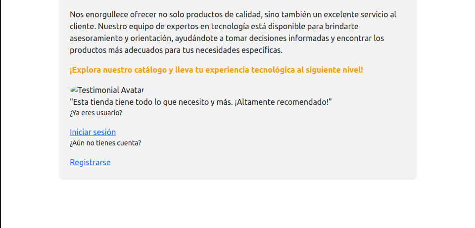

# suministros-informaticos
Sistema que maneja los suministros informaticos


## Objetivos del proyecto:

El objetivo es crear una plataforma para una empresa de suministros informáticos, en la cual se
desarrollara una aplicación web que le ayude con la gestión tanto de sus productos como con la de sus
proveedores permitiéndole ver en tiempo real datos y estadísticas de sus ventas y salidas de almacen.

## Stack tecnológico y alternativas evaluadas

Stack tecnologico:
- Frontend:
- HTML
- CSS(Bootstrap)
- Javascript
- Backend:
- Flask
- Sqlite3
- pip

## Alternativas evaluadas:
- Django
- React
- Tailwindcss
- Postgresql
- Mysql.

## Explicación de los requisitos de la aplicación:

Flask: Es un framework de rapido desarrollo hecho en python que nos permite crear aplicaciones web
simples y complejas con gran facilidad.
Bootstrap: Framework de css que nos ayuda al rapido desarrollo del diseño y estilado de una pagina web
Sqlite3: Base de datos versatil muy util y potente para proyectos pequeños que no requiren gran cantidad
de consultas.

## Manual de instalación


## Instalación

### Instalacion del entorno virtual

```
python3.exe -m venv [nombre_entorno]

```

### agregar todas las librerias del requirements.txt a nuestro entorno virtual

```
pip install -r requirements.txt
```
### Instalacion en Docker

- Construyendo la imagen: 
```
docker build -t <nombre-imagen>:<tag> .
ejemplo:
docker build -t suministros:latest .
```
<nombre-imagen> : nombre que le vamos a poner a la imagen(cualquiera :) )
<tag>: una etiqueta cualquiera que nos va a ayudar a identificar un especifico build (cualquiera tambien)

- Corriendo la imagen en un contenedor:

```
docker run -d -p <port-exposed>:<port-internal> <nombre-imagen>:<tag>
ejemplo:
docker run -d -p 8000:5000 suministros:latest
```
-d es "detach mode" que corre el contenedor sin necesidad de ver los cambios en la terminal
-p es el puerto en el cual queremos correr el contenedor

- Deteniendo el contenedor

```
docker stop <hash-code-container>
docker stop 893ff1fe1825
```

** Repite la operacion cada vez que hayas hecho un cambio en el proyecto
	- build image
	- run image 
	- stop image 

## Esquema de la base de datos

## Screenshots de la aplicacion

### Description

<div>
	<p>La pagina principal en la que podemos encontrar el login y la registracion</p>
	<div>
		
		<small>Image de pagina principal</small>
	</div>
</div>


## Conclusiones y evolutivos del proyecto (cosas a mejorar)

- Hemos sido capaces de implementar un sistema de login
- Se ha implementado satisfactoriamente una coneccion con la base data.
- Se han creado vistas para la interaccion con la base de datos(Crear cuenta, crear pedido, crear producto, eliminar productio, etc)
- Se podido crear un template base para los archivos html y css del proyecto.
- Hemos sido capaces de poder usar de manera efectiva los "jinja templates" tambien variables del template 


### Evolutivos del proyecto(cosas a mejorar )

- Implementar un sistema de validaciones para la creacion de usuario
- Implementar un sistema de validaciones para el login, y los demas formularios de las vistas.
- Agregar mas estilos a las vistas y mejorar la experiencia de usuario.